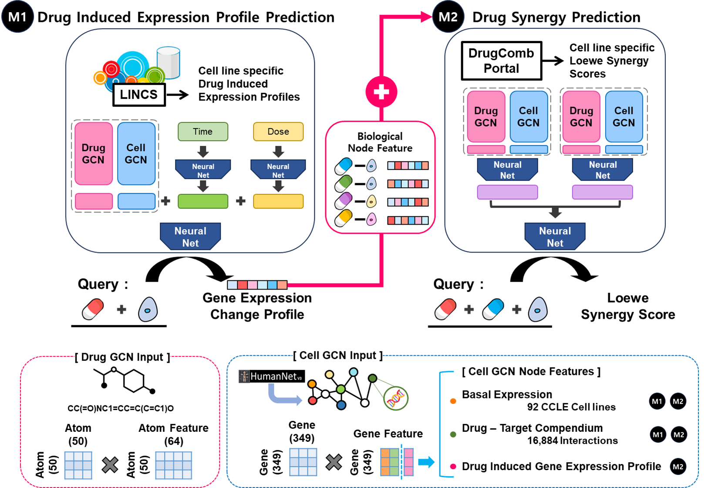

# DRSPRING
DRug Synergy PRediction by INtegrated GCN(DRSRPING) is separated into two modules. 

The module_1, PDIGEC, predicts Drug Induced gene expression of each Drug-Cell line-Dose-Time profile. 

The module_2, PDSS, predicts Drug synergy score(Loewe score) of each drug-drug-cell triads.




## Prerequisites
cuda 11.6 (in case of using GPU)


## Install required packages
Use the environment.yml file in directory

```
conda create -y --name py37 python=3.7.16
conda activate py37
conda env update --file environment.yml
pip install torch-scatter -f https://data.pyg.org/whl/torch-1.13.0+cu116.html
pip install torch-sparse -f https://data.pyg.org/whl/torch-1.13.0+cu116.html
pip install torch-geometric==2.0.4
```


## Training model
**(1) Module_1 (PDIGEC)**
```
python PDIGEC.py /home/minK/ssse/final/final_data/  
```

**(2) Module_2 (PDSS)**

In case you want to use early stopping in training module, you can use the option `--early_stopping`

The example code is presented below : 
```
python PDSS.py [result directory] --mode 'train' --early_stopping 'es'
python PDSS.py ~/DRSPRING/PDSS/result --mode 'train' --early_stopping 'es'
```


## Use our trained model to predict your data
We support Drugs experiment from CCLE ver? 10xx cell line, check cell line list in lincs_wth_ccle_org_all.csv file. If you want train or test cell line that are not in CCLE ver?, you have to provide Cell line's basal expression to the model to use it. Add --basal option to use new cell line. Make sure drug_cell, smiles, basal files are all in ./final_data/raw/.

**(1) Module_1 (PDIGEC)**

We also support gene expression prediction for new chemicals, new ccle cell line, new doses, new dosage time.
```
python PDIGEC.py ./final_data/ --mode 'new_data' --saved_model ./final_data/model_tvt.pt \
--drug_cell 'new_drug_cellline.csv' \
--smiles 'new_drug_0815.csv'
```

If you want to get gene expression predicted value of 1393 ccle cell lines that we used, try this code!
All you need to provide is cid and smiles id in csv file by --smiles.
```
python PDIGEC.py ./final_data/ --mode 'new_data_cellline_all' --saved_model ./final_data/model_tvt.pt \
--smiles 'new_drug_0815.csv'
```

**(2) Module_2 (PDSS)**
1) In case you just give just new smiles of two drugs, we automatically present all predicted scores of 92 cells we used in training.
   Also, this mode requires the Module 1 derived files of each input SMILES.

```
python PDSS.py [result directory] --mode 'new_data' --saved_model [pretrained model] --DrugAsmiles [SMILES A] --DrugBsmiles [SMILES B] --M1_DrugA [Module 1 result of SMILES A] --M1_DrugB [Module 1 result of SMILES B]
python PDSS.py ~/DRSPRING/PDSS/result --mode 'new_data' --saved_model ~/DRSPRING/PDSS/result/MODEL.pt --DrugAsmiles 'C1C(N(C2=C(N1)N=C(NC2=O)N)C=O)CNC3=CC=C(C=C3)C(=O)NC(CCC(=O)O)C(=O)O' --DrugBsmiles 'C1=C(C(=O)NC(=O)N1)F' --M1_DrugA '~/DRSPRING/PDIGEC/M1_expression_A.csv' --M1_DrugB '~/DRSPRING/PDIGEC/M1_expression_B.csv'
```

2) In case you give new smiles of two drugs and new CCLE data, you should additionally provide new data directory.
This also requires the Module 1 derived files of each input SMILES.
```
python PDSS.py [result directory] --mode 'new_data' --saved_model [pretrained model] --DrugAsmiles [SMILES A] --DrugBsmiles [SMILES B] --M1_DrugA [Module 1 result of SMILES A] --M1_DrugB [Module 1 result of SMILES B] --Basal_Cell [User provided new CCLE data]
python PDSS.py ~/DRSPRING/PDSS/result --mode 'new_data' --saved_model ~/DRSPRING/PDSS/result/MODEL.pt --DrugAsmiles 'C1C(N(C2=C(N1)N=C(NC2=O)N)C=O)CNC3=CC=C(C=C3)C(=O)NC(CCC(=O)O)C(=O)O' --DrugBsmiles 'C1=C(C(=O)NC(=O)N1)F' --M1_DrugA '~/DRSPRING/PDIGEC/M1_expression_A.csv' --M1_DrugB '~/DRSPRING/PDIGEC/M1_expression_B.csv' --Basal_Cell '~/DRSPRING/data/new_cell.csv'
```


